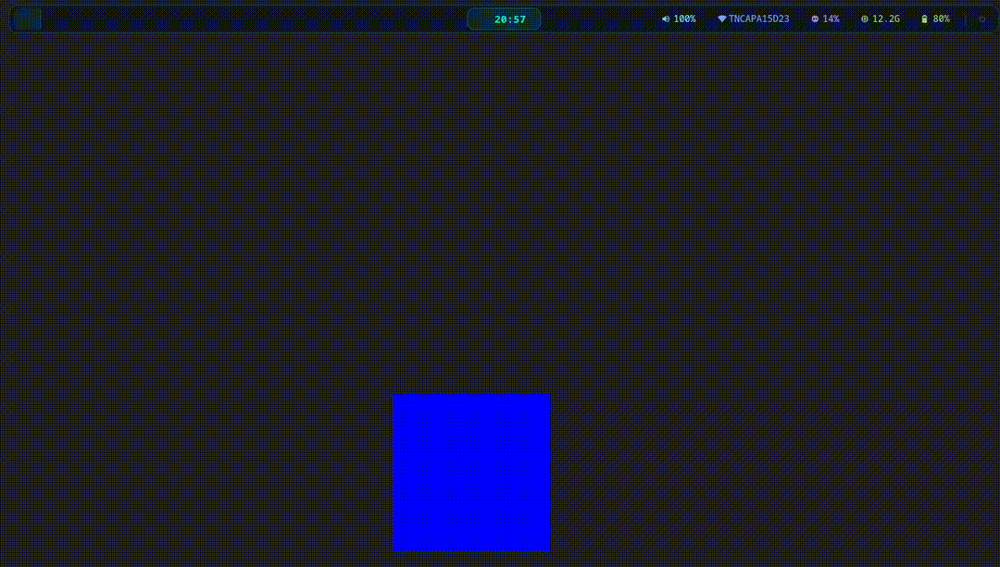
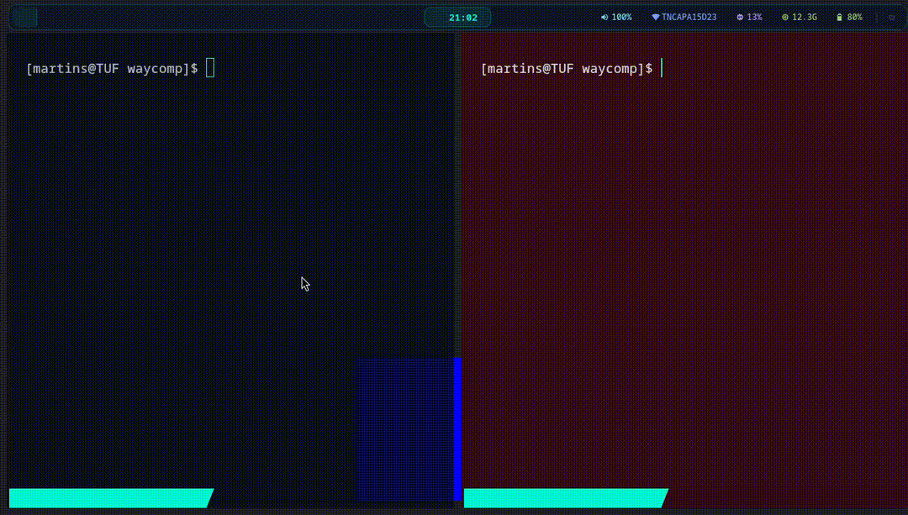
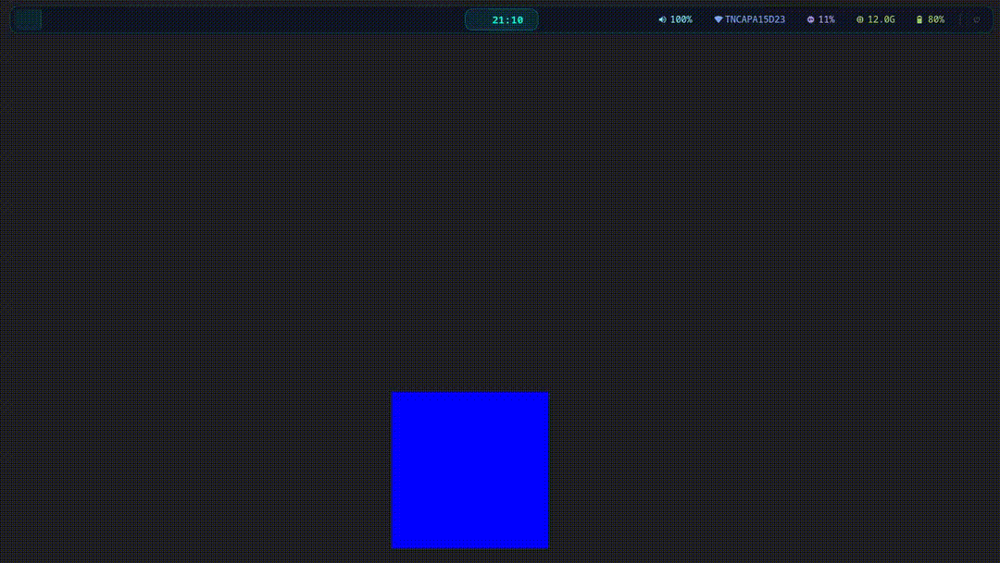
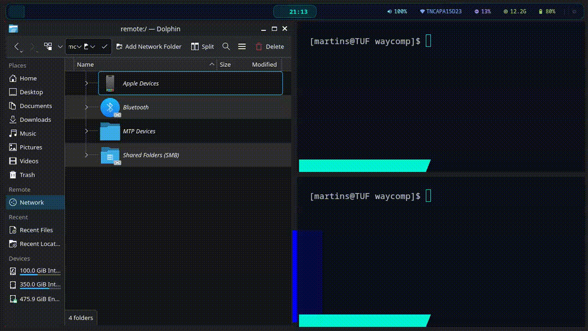
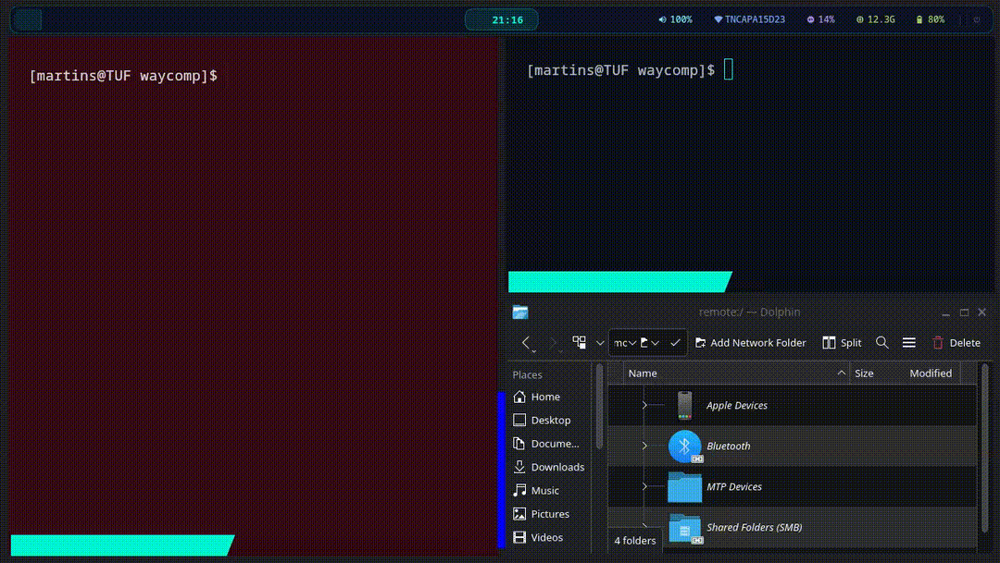
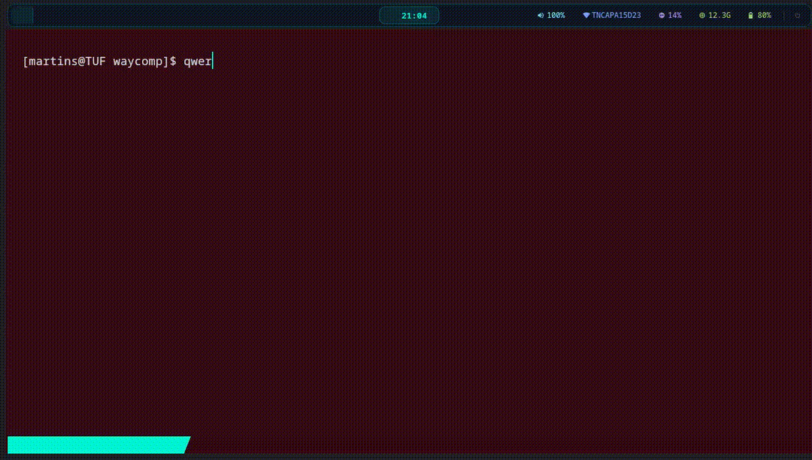

  <h1>Basic Wayland Compositor</h1>

  

    <strong>A lightweight, C-based Wayland compositor prototype built as part of a Bachelor's thesis.</strong>
  

  

    Developed over a two-month period, this project serves as a proof-of-concept for core Wayland window management and input handling rather than a full daily driver.
  

  

    
    
    
  

---

## 🌟 Key Features

### 💻 Client & Window Management

* **Client Open / Close:** Graceful spawning and termination of Wayland surfaces.
  

    
  

* **Window Focus:** Visual and input focus switching across open clients.
  

    
  

* **Basic Window Tiling:** Automatic grid-based layout for active windows.
  

    
  

* **Window Position Switch:** Swapping client positions dynamically across the grid.
  

    
  

* **Window Resizing:** Real-time surface surface allocation and scaling.
  

    
  

---

### 🖱️ Input Handling

* **Mouse Cursor Tracking:** Smooth pointer hardware integration and rendering.
  

    
  

* **Keyboard Functions:** Routing key events directly to focused clients.
  

    
  

